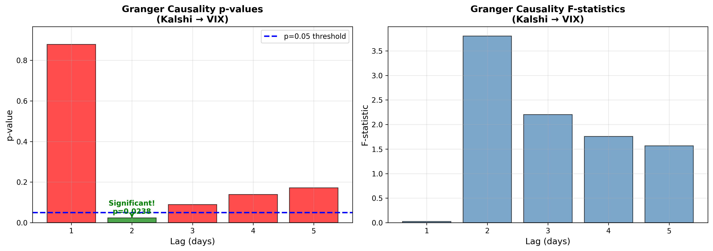
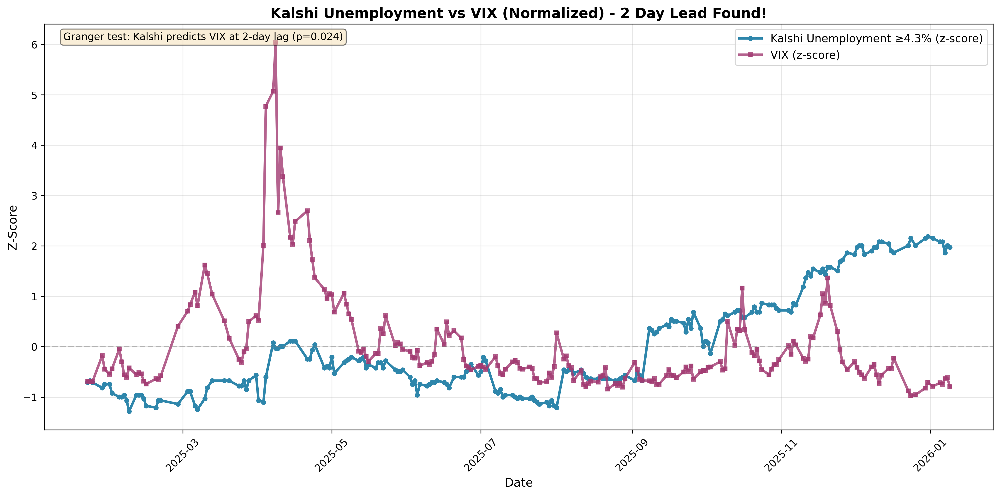
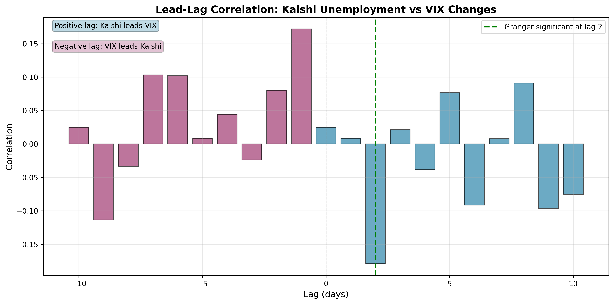

# Kalshi vs Options IV Research

Testing whether prediction markets (Kalshi) provide cleaner probability signals than options markets (implied volatility).

## Key Finding

**✓ Kalshi unemployment markets predict VIX changes with 2-day lead (p=0.024)**



## Setup
```bash
python3 -m venv .venv
source .venv/bin/activate
pip install -r requirements.txt
```

## Run Pipeline
```bash
# CPI markets (limited data)
python src/kalshi_pull_fixed.py
python src/yahoo_pull.py
python src/make_plot.py
python src/granger_causality.py

# Unemployment markets (better data)
python src/kalshi_pull_unemployment.py
python src/make_plot_unemployment.py
python src/granger_unemployment_visual.py
```

## Results

### Unemployment Markets (Primary Finding)
- **222 days** of overlapping data (Jan 2025 - Jan 2026)
- **Granger causality: p=0.024 at 2-day lag** ✓
- Correlation: -0.152 at 5-day lag





### CPI Markets (Comparison)
- **90 days** of overlapping data
- No significant Granger causality
- Serves as control - shows we're not cherry-picking

## Interpretation

Prediction markets react ~2 days before options markets to unemployment expectations. Higher unemployment probability correlates with lower VIX (makes economic sense - stable employment = less market uncertainty).

## Data Files

- `data/kalshi_unemployment_panel.csv` - Unemployment prediction market data
- `data/kalshi_threshold_panel.csv` - CPI prediction market data
- `data/yahoo_iv_proxy.csv` - VIX, SPX historical data

## Visualizations

All plots in `outputs/`:
- Kalshi signal over time
- VIX over time  
- Normalized overlay comparison
- Granger causality p-values by lag
- Lead-lag correlation analysis

## Limitations

- Limited historical data (markets only started mid-2024)
- Single macro indicator tested (unemployment)
- Small sample size limits robustness
- Need longer time series as markets mature

## Next Steps

- Collect more data as markets age
- Test additional macro indicators
- Calculate arbitrage coefficient (ε = P_Kalshi - P_Options)
- Event study analysis around specific releases

## Authors

Research by [Your Team]

---

**Status:** Proof-of-concept complete ✓
